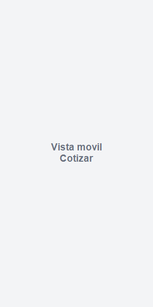
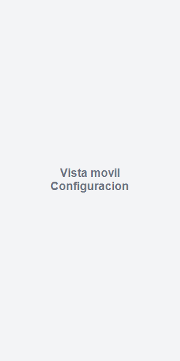
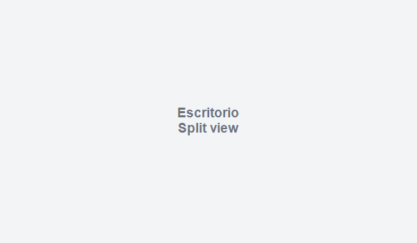
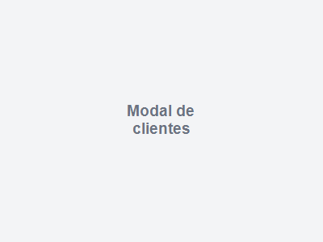
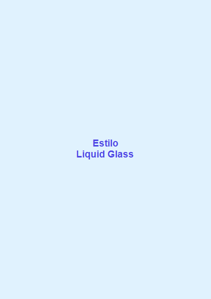

<div align="center">


# Cotizador Global

**Genera cotizaciones y presupuestos profesionales desde cualquier dispositivo.**

[](https://developer.mozilla.org/es/docs/Web/HTML)
[](https://tailwindcss.com/)
[](https://developer.mozilla.org/es/docs/Web/JavaScript)
[](https://fontawesome.com/)
[](https://github.com/Suarezsh/cotizador-global)

[Ver demo en vivo](https://suarezsh.github.io/cotizador-global/) · [Reportar issue](https://github.com/Suarezsh/cotizador-global/issues) · [Solicitar feature](https://github.com/Suarezsh/cotizador-global/issues)

</div>

---

## Tabla de contenidos

- [Descripcion](#descripcion)
- [Caracteristicas principales](#caracteristicas-principales)
- [Capturas de pantalla](#capturas-de-pantalla)
- [Tecnologias](#tecnologias)
- [Como usar](#como-usar)
  - [Requisitos](#requisitos)
  - [Instalacion local](#instalacion-local)
  - [Primeros pasos](#primeros-pasos)
- [Estructura del proyecto](#estructura-del-proyecto)
- [Flujo de trabajo](#flujo-de-trabajo)
- [Personalizacion](#personalizacion)
- [Roadmap](#roadmap)
- [Contribuciones](#contribuciones)
- [Licencia](#licencia)
- [Contacto](#contacto)

---

## Descripcion

**Cotizador Global** es una aplicacion web estatica que permite a profesionales, freelancers y pequenos negocios crear cotizaciones y presupuestos de forma rapida y profesional. Funciona completamente en el navegador sin necesidad de backend, utilizando `LocalStorage` como base de datos local.

La aplicacion esta disenada para adaptarse a cualquier moneda, impuesto, idioma o formato regional del mundo. Todos los datos son editables: configuracion global, clientes, monedas, impuestos, estilos visuales y cada cotizacion individual.

---

## Caracteristicas principales

### Panel de cotizacion
- Creacion rapida de cotizaciones con numero, fechas, cliente, descuentos y anticipos.
- Tabla dinamica de items con descripcion, tipo, unidad, cantidad, precio y descuento por linea.
- Reordenamiento de items con flechas arriba/abajo.
- Control de impuestos por item o aplicacion global a todos los items.
- Calculos automaticos en tiempo real de subtotales, descuentos, impuestos, total, anticipo y saldo pendiente.

### Panel de administracion
- Datos completos del emisor: nombre, slogan, logo, contacto, direccion, identificacion fiscal y sitio web.
- Gestion de clientes con informacion de contacto.
- Gestion de monedas personalizadas con simbolo, posicion y separadores.
- Gestion de impuestos personalizados con modo agregado o incluido.
- Terminos, condiciones, notas de agradecimiento y pie de pagina.
- Estilos visuales para el PDF: Clasico, Moderno, Minimalista, Maximalista, Brutalista, Skeuomorfismo, Claymorfismo, Liquid Glass y UI Espacial.
- Color de acento personalizable.

### Disenio y experiencia de usuario
- Interfaz responsive 100% mobile-first.
- Menu inferior tipo Temu para navegacion rapida en dispositivos moviles.
- Modales flotantes para todas las acciones de administracion.
- Vista previa A4 en vivo del documento final.
- Iconos profesionales de Font Awesome en toda la interfaz.

### Acciones de salida
- Exportar a PDF mediante impresion nativa.
- Compartir por WhatsApp.
- Enviar por correo electronico.
- Copiar enlace compartible con los datos codificados.
- Guardar y cargar cotizaciones desde LocalStorage.
- Duplicar cotizaciones.
- Respaldo y restauracion completa en JSON.

---

## Capturas de pantalla

<div align="center">

| Vista movil - Cotizar | Vista movil - Configuracion | Vista previa PDF |
|:---:|:---:|:---:|
|  |  |  |

| Escritorio - Split view | Modal de clientes | Estilo Liquid Glass |
|:---:|:---:|:---:|
|  |  |  |

</div>

> Nota: Las capturas de pantalla son ilustrativas. Puedes reemplazarlas por imagenes reales en la carpeta `docs/screenshots/`.

---

## Tecnologias

| Tecnologia | Uso |
|---|---|
| HTML5 | Estructura semantica de la aplicacion. |
| Tailwind CSS | Estilos utilitarios y disenio responsive. |
| JavaScript Vanilla | Logica de negocio, estado y manipulacion del DOM. |
| Font Awesome 6 | Iconografia profesional. |
| LocalStorage | Persistencia local de datos. |

No se utilizan frameworks ni dependencias de backend. La aplicacion es completamente estatica y puede ejecutarse abriendo el archivo `index.html` directamente.

---

## Como usar

### Requisitos

- Un navegador web moderno (Chrome, Firefox, Edge, Safari).
- Conexion a internet solo para cargar Tailwind CSS y Font Awesome desde CDN.

### Instalacion local

1. Clona el repositorio:

```bash
git clone https://github.com/Suarezsh/cotizador-global.git
```

2. Entra en la carpeta del proyecto:

```bash
cd cotizador-global
```

3. Abre el archivo `index.html` en tu navegador:

```bash
# En Windows
start index.html

# En macOS
open index.html

# En Linux
xdg-open index.html
```

O usa una extension como Live Server en Visual Studio Code para una mejor experiencia de desarrollo.

### Primeros pasos

1. **Configura tu negocio**: abre la configuracion y completa los datos del emisor.
2. **Agrega clientes, monedas e impuestos**: desde los modales flotantes correspondientes.
3. **Personaliza el estilo visual**: elige un estilo para tu PDF y un color de acento.
4. **Crea una cotizacion**: selecciona el cliente, agrega items y ajusta descuentos.
5. **Visualiza y exporta**: revisa la vista previa A4 y exporta a PDF.

---

## Estructura del proyecto

```text
cotizador-global/
├── index.html                  # Punto de entrada de la aplicacion
├── README.md                   # Documentacion del proyecto
├── requerimientos.txt          # Requerimientos originales del proyecto
├── assets/
│   ├── css/
│   │   └── styles.css          # Estilos personalizados y estilos visuales del PDF
│   ├── js/
│   │   ├── app.js              # Logica principal y navegacion
│   │   ├── admin.js            # Gestion de modales de administracion
│   │   ├── calculations.js     # Motor de calculos de cotizaciones
│   │   ├── defaults.js         # Datos de ejemplo por defecto
│   │   ├── formatters.js       # Formateo de monedas, fechas y etiquetas
│   │   ├── preview.js          # Renderizado de la vista previa A4
│   │   ├── quote.js            # Panel de cotizacion
│   │   ├── state.js            # Estado global y persistencia en LocalStorage
│   │   └── storage.js          # Funciones de respaldo/restauracion JSON
│   └── logo.svg                # Logo del proyecto (opcional)
└── docs/
    └── screenshots/              # Capturas de pantalla para el README
```

---

## Flujo de trabajo


---

## Personalizacion

### Estilos visuales del PDF

El panel de administracion permite seleccionar entre multiples estilos visuales para la hoja A4:

- Clasico
- Moderno
- Minimalista
- Maximalista
- Brutalista
- Skeuomorfismo / Clasmorfismo
- Claymorfismo
- Liquid Glass
- UI Espacial

Cada estilo aplica colores, sombras, bordes y tipografias diferentes a la vista previa.

### Color de acento

Puedes personalizar el color principal que se utiliza en titulos, totales y elementos destacados del PDF.

### Monedas e impuestos

Agrega tantas monedas e impuestos como necesites. Cada cotizacion utiliza la moneda y los impuestos marcados por defecto.

---

## Roadmap

- [x] Disenio responsive con menu inferior tipo Temu.
- [x] Modales flotantes para administracion.
- [x] Estilos visuales avanzados para el PDF.
- [x] Control de impuestos por item y global.
- [x] Alertas y confirmaciones en modales.
- [ ] Modo oscuro para el panel de administracion.
- [ ] Catalogo de productos y servicios guardados.
- [ ] Firma digital en el PDF.
- [ ] Soporte para multiples cotizaciones activas.

---

## Contribuciones

Las contribuciones son bienvenidas. Si deseas mejorar el proyecto:

1. Haz un fork del repositorio.
2. Crea una rama para tu feature: `git checkout -b feature/nueva-funcionalidad`.
3. Realiza tus cambios y haz commit: `git commit -m 'Agrega nueva funcionalidad'`.
4. Sube los cambios a tu fork: `git push origin feature/nueva-funcionalidad`.
5. Abre un Pull Request en el repositorio original.

---

## Licencia

Este proyecto esta bajo la licencia MIT. Puedes usarlo, modificarlo y distribuirlo libremente.

---

## Contacto

- **Proyecto**: [github.com/Suarezsh/cotizador-global](https://github.com/Suarezsh/cotizador-global)
- **Issues**: [github.com/Suarezsh/cotizador-global/issues](https://github.com/Suarezsh/cotizador-global/issues)


</div>
